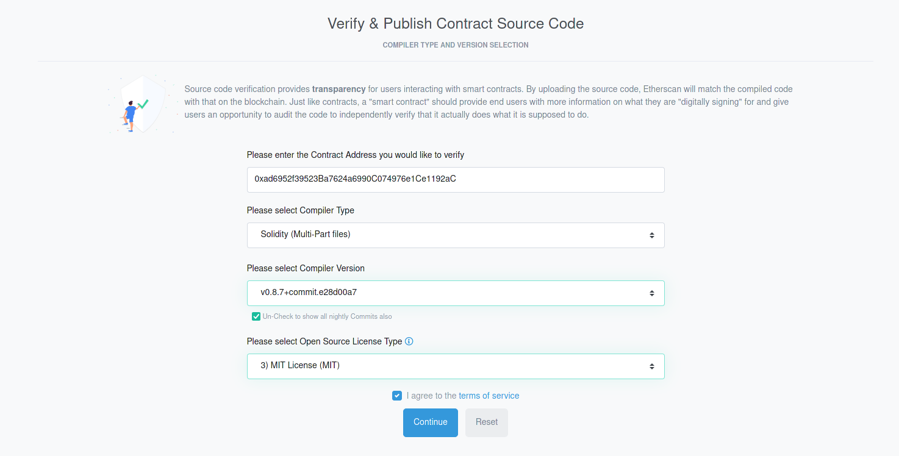
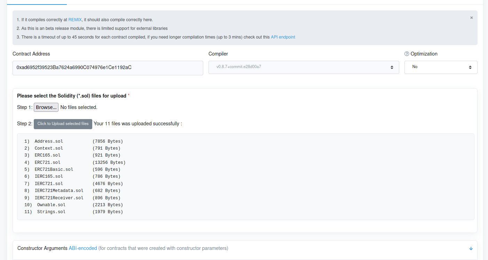
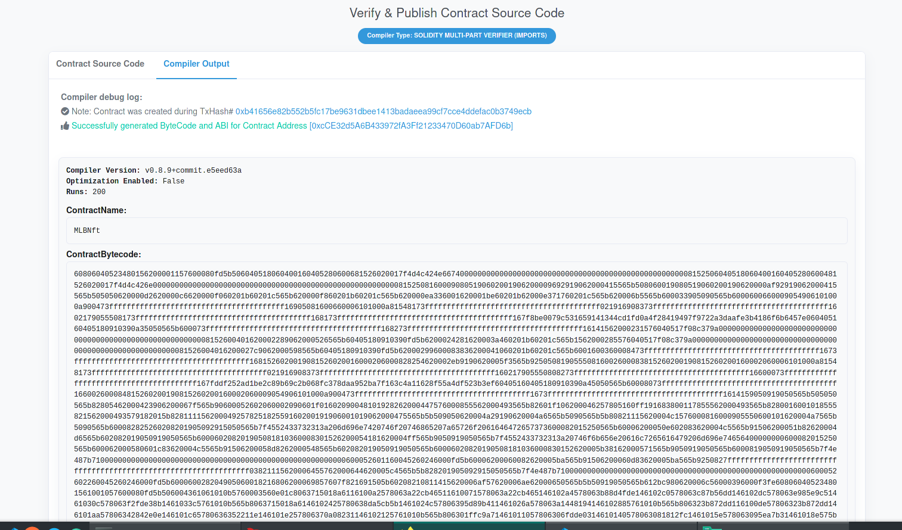

Step By Step guide on how to create your very own ERC-721 token
===

In this guide, we will go through the process of how to create an `ERC-721` token.  
`ERC-721` is a standard for representing ownership of non-fungible tokens.  
a non-fungible token can represnte a piace of data stored somewhere, like a decnetrizled storage.  

We are going to create an ERC-721 token that represnte a picture i have stored in [siasky](https://siasky.net/).  
> https://siasky.net/EABmgOTKUkcmmxYebuLZKQYUw6rygnC0SDLJ84pVCEnn_A

# Requirements

* `Nodejs`: 14
   * `openzeppelin/contracts`: 4.3
   * `ethereum-smart-contract-deployer` : 1.1.6
      * `solc`: 0.8.9
      * `web3`: 1.6.0

You can install `Nodejs`, `Solidity` in your **Linux/Windows** with your package manager. in this case `Pacman`
```bash
sudo pacman -S nodejs geth
sudo npm install -g solc
solcjs --version
```

Clone the repo and install dependencies
```bash
git clone https://github.com/mlibre/blockchain
cd Ethereum/ERC721/
npm i
npm i --dev-only
```

# Files
* `ERC721Basic.sol`: The contract source code
* `main.js`: A contract deployer written in **Nodejs** 
* `bin`: Compile's output

# Getting start
As you may have already noticed, we are using the **openzeppelin** contracts V4.  
So the contract code, `ERC721Basic.sol` is basically is few lines of codes!

```javascript
// SPDX-License-Identifier: MIT
pragma solidity ^0.8.9;

import "./ERC721.sol";
import "./Ownable.sol";

contract MLBNft is ERC721, Ownable {
    constructor() ERC721("MLBNft", "MLBn") {
        super._mint(msg.sender, 1);
    }

    function _baseURI() internal pure override returns (string memory) {
        return "https://siasky.net/EABmgOTKUkcmmxYebuLZKQYUw6rygnC0SDLJ84pVCEnn_A";
    }

    function safeMint(address to, uint256 tokenId) public onlyOwner {
        _safeMint(to, tokenId);
    }
}

```
`MLBNft` is the token name.  
And `MLBn`, that is the symbol.

# Compile via Solc

> You don't have to compile the contract with `solc` as `Contract Deployer.js` will compile it itself. but it is good to see if there are any errors.  

```bash
solc ERC721Basic.sol  -o ./bin/ --combined-json=abi,bin,metadata --pretty-json --metadata --gas --abi --bin --overwrite --color
```

## Options
* `--metadata`: creates metadata
* `--abi`: creates abi
* `--bin`: creates bin
* `--combined-json=abi,bin,metadata`: creates a json containing all above

# Deploying on Goerli
If everything went well. it is time to deploy our contract on the Blockchain!
```bash
geth --goerli --http --syncmode=light --http.api="eth,net,web3,personal,txpool" --allow-insecure-unlock  --http.corsdomain "*"
```

## Importing an account into Geth
If you have not added your account in the local `Geth` before
```bash
# rm -r /home/mlibre/.ethereum/goerli/geth/
# rm -r /home/mlibre/.ethereum/geth
geth account import ~/Data/myself/cryptocurrency-info-recovery/metamask/mforgood/D8_private_key
# Set a password
```

## Unlocking an account in **Geth**
```bash
geth --goerli --http --syncmode=light --http.api="eth,net,web3,personal,txpool" --allow-insecure-unlock  --http.corsdomain "*"
geth attach http://127.0.0.1:8545
web3.personal.importRawKey("AccountPrivateKey", "ThePasswordYouJustSet")
# copy the address
personal.unlockAccount("TheAddress")
# Type the password
```

## Running Deployer
Now It is time to deploy the contract on the blockchain.  
Open the `main.js` file and set the Deployer's arguments.

```bash
node main.js 
```

Congrats! it is done :)
the output should be something like this:

```java
Network Name:  goerli
Network Peers:  17

Solidity Version: 0.8.9
Compiling contract ERC721Basic.sol -> MLBNft

ETH balance:  5.829774442502007989
Gas:  2600228
Gas Price in ETH:  0.0000000019400003
Total Cost in ETH:  0.0050444431000684
ETH balance after deploying:  5.8247299994019395

Deploying Contract ...
Arguments:  []

Transaction hash: 0x0e5227da04038faecbc9e50400716f3805ee9edb87b53bbce89343d069351a29
Confirmation Number: 0
Owner: 0xD8f24D419153E5D03d614C5155f900f4B5C8A65C
Contract Address: 0xCa8234A0fdaAeFF1Ed3435E0832406b944c71327
Etherscan.io: https://goerli.etherscan.io/address/0xCa8234A0fdaAeFF1Ed3435E0832406b944c71327
```
If you click on the last link you will find the token.

# Verifying the contract
1. So first copy all the contract files (If you are using openzeppelin wizard, you can download vendor zip).  to a folder like `combined`.   
2. Then change the `imports' paths` to current path.
3. And all the sol versions to your solc version (0.8.9)
4. Deploy the contract again
```bash
node main.js -f combined/MLBNft.sol -c MLBNft -s "0xD8f24D419153E5D03d614C5155f900f4B5C8A65C" -p "password" -h "http://127.0.0.1:8545"
```
5. Verify the new contract address

I have done it for this example. you can find all the modified files in **combined** folder.  
If **etherscan** was unable to detect the constructor parameters. you can use [hashex](https://abi.hashex.org/). copy the `TOKENNAME_abi.json` file that the deployer has made. and paste it in **hashex**. We passed the value '7' to the contract constructor.  
Now deploy the contract.

Open [goerli.etherscan.io/verifyContract](https://goerli.etherscan.io/verifyContract)

## Settings
* Contract Address: 0xcCE32d5A6B433972fA3Ff21233470D60ab7AFD6b (YOUR CONTRACT ADDRESS)
* Compiler Type: Multi part files
* Compiler Version: 0.8.7
* License MIT
* Optimization: No

## Images

* Settings

   

* Files upload. Files are necessary always like this. These photos just show the whole idea.

     

* Verified
   
   


## Interacting via Geth
```bash
geth attach http://127.0.0.1:8545
personal.unlockAccount("0xd8f24d419153e5d03d614c5155f900f4b5c8a65c")

var abi = [{"inputs":[{"internalType":"uint256","nam"
var MyContract = web3.eth.contract(abi);
# Copy Contract Address
var MyContractInstance = MyContract.at('0xcCE32d5A6B433972fA3Ff21233470D60ab7AFD6b');
MyContractInstance.balanceOf("0xd8f24d419153e5d03d614c5155f900f4b5c8a65c" , {from: eth.accounts[0]});
```

## Interacting via web3js
If you like to call contract functions like `mint`, I have also implemented some in `main.js` like `getBalance` and `mint` **functions**.